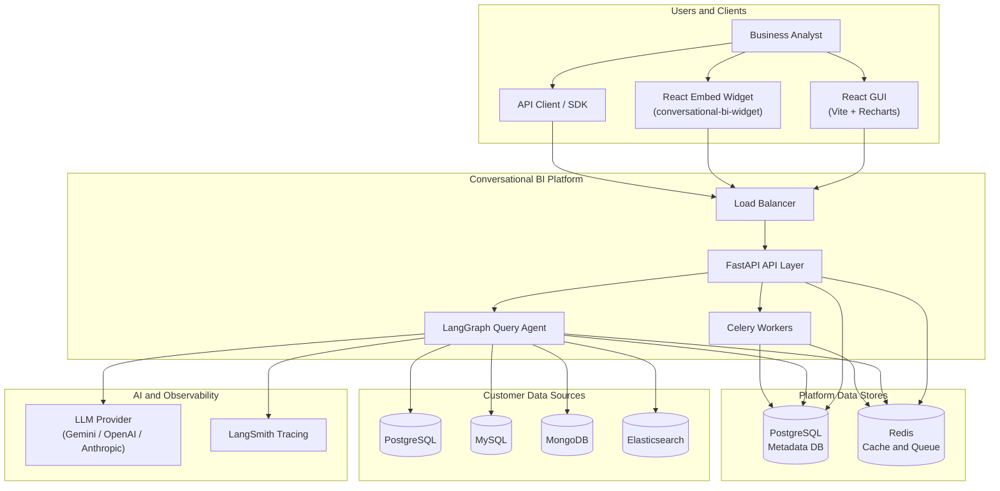
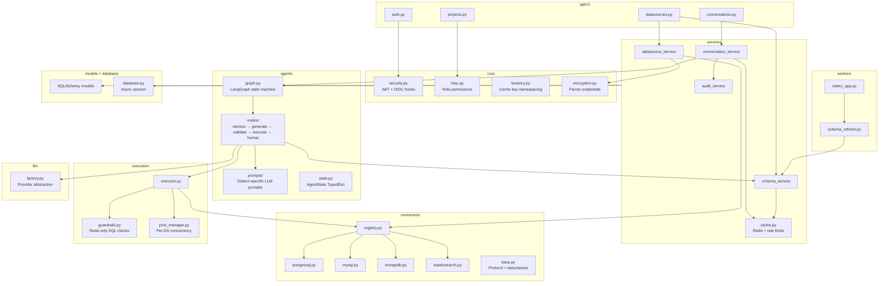
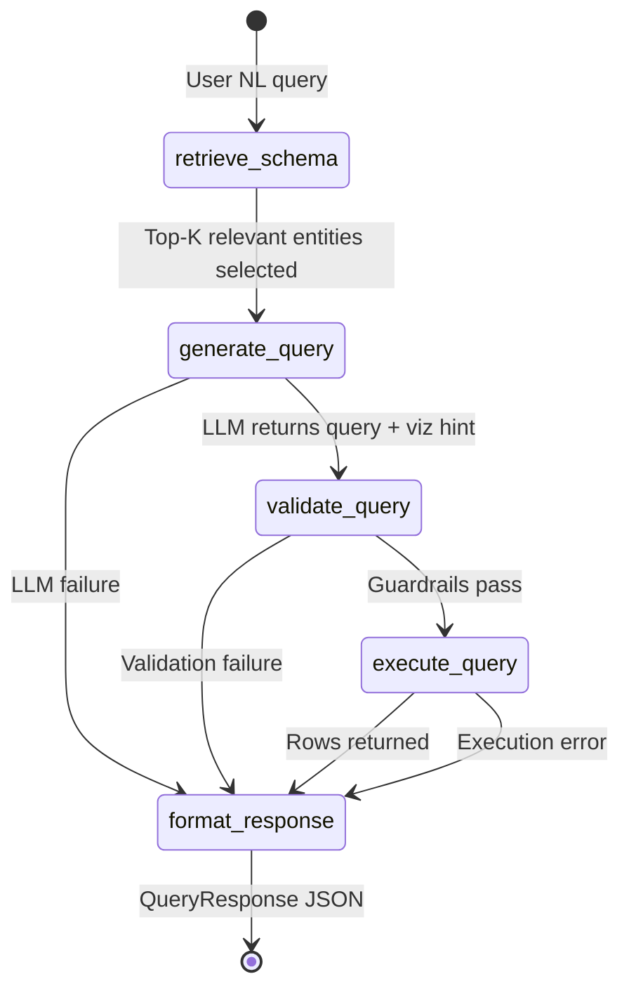
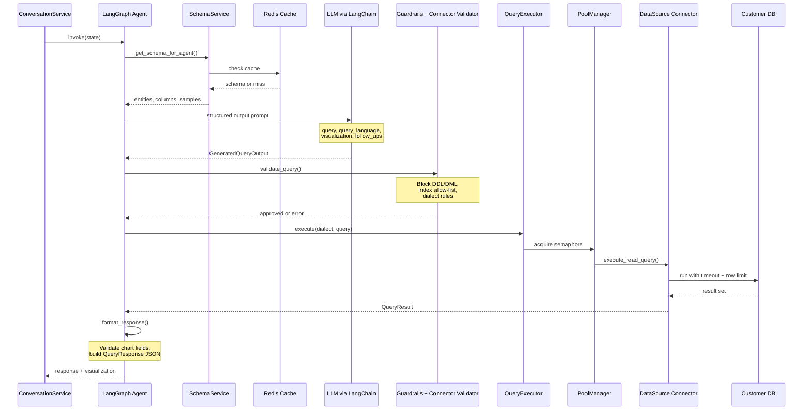
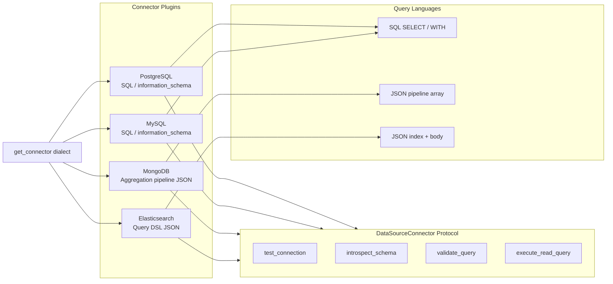
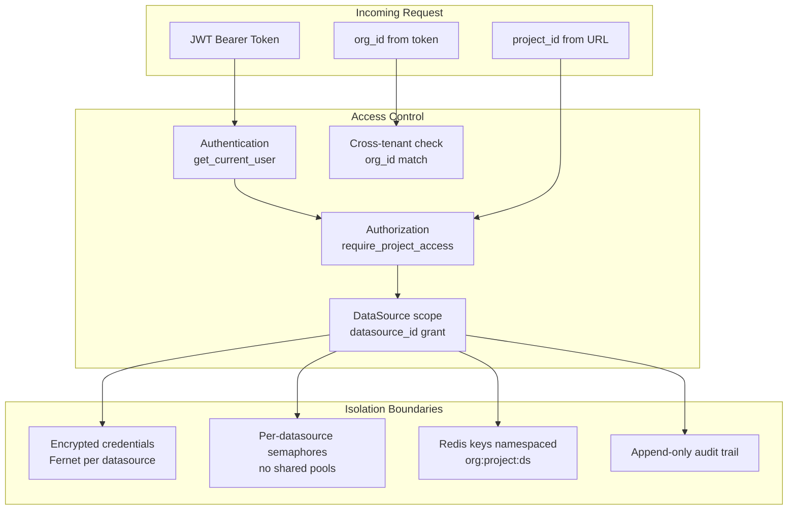
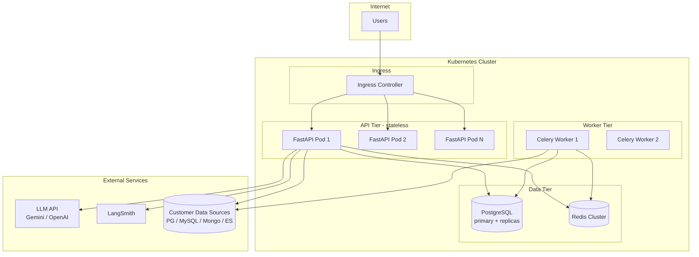
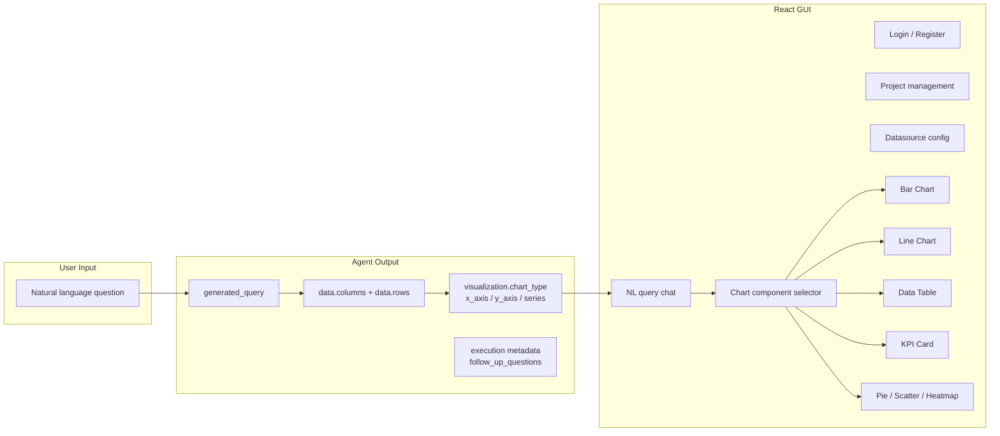
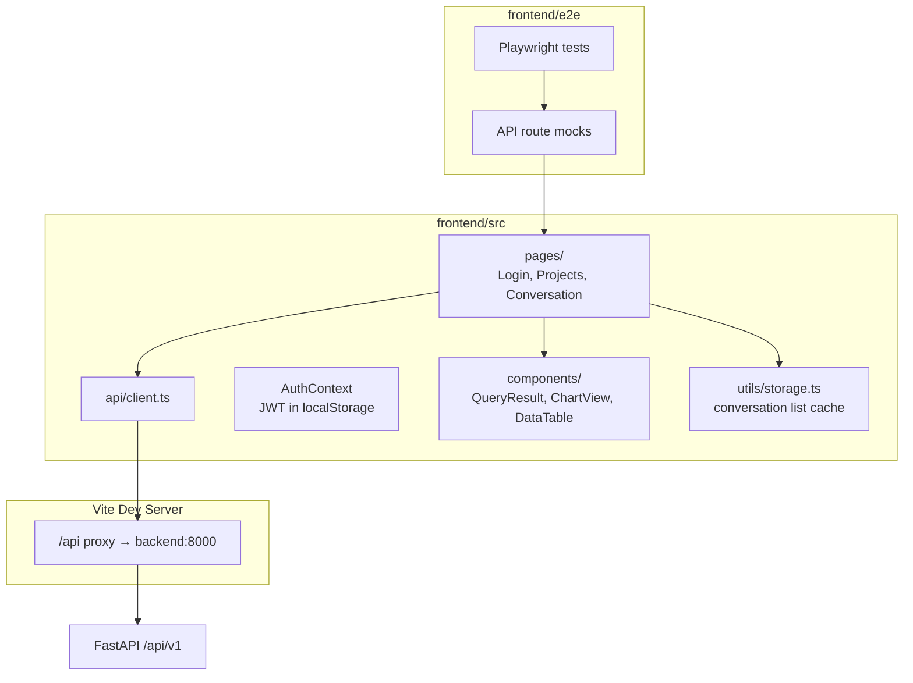

# Conversational BI — Architecture Diagrams

This document provides high-level and low-level architecture views of the platform as implemented in the backend MVP.

---

## 1. High-Level Architecture

The platform is a **multi-tenant, agentic data query service**. Users ask questions in natural language; the system introspects connected data sources, generates a safe read-only query via LLM, executes it, and returns structured JSON for chart rendering in the React GUI.



### High-level responsibilities

| Layer | Responsibility |
|-------|----------------|
| **API Layer** | Auth, RBAC, tenancy enforcement, REST endpoints |
| **Agent Layer** | NL → query generation, validation, execution orchestration |
| **Connector Layer** | Pluggable adapters for each data source dialect |
| **Platform Data** | Metadata, conversations, audit logs, encrypted secrets |
| **Intelligence** | Swappable LLM + LangSmith observability |

### Tenant hierarchy

```
Organization  (billing + SSO boundary)
  └── Project   (workspace)
        └── DataSource  (encrypted connection + schema snapshots)
  └── Users + RBAC memberships
```

---

## 2. Low-Level Architecture — Component View

Internal module structure of the Python backend (`backend/app/`).



---

## 3. Low-Level Architecture — Query Agent Flow

The LangGraph agent is the core of conversational BI. Each user message triggers this state machine.



### Agent nodes (detail)



---

## 4. Low-Level Architecture — Data Source Connectors

All connectors implement the same protocol. The registry selects the implementation by `DataSourceType`.



### Connector capabilities

| Connector | Entity type | Introspection | Query format | Read-only enforcement |
|-----------|-------------|---------------|--------------|----------------------|
| PostgreSQL | `table` | `information_schema` + FK | SQL | sqlparse + keyword blocklist |
| MySQL | `table` | `information_schema` | SQL | sqlparse + keyword blocklist |
| MongoDB | `collection` | `$sample` + type inference | Pipeline JSON | Block `$out`, `$merge`, etc. |
| Elasticsearch | `index` | mappings + search samples | `index` + `body` JSON | Block `script`, `update`, etc. |

---

## 5. Low-Level Architecture — Security and Multi-Tenancy



### RBAC roles

| Role | Configure datasources | Run queries | Manage project |
|------|----------------------|-------------|----------------|
| `org_admin` | Yes | Yes | Yes (all projects) |
| `project_admin` | Yes | Yes | Yes |
| `analyst` | No | Yes | No |
| `viewer` | No | Yes (limited) | No |

---

## 6. Low-Level Architecture — Deployment Topology

Target deployment for scale (1M+ users). MVP runs all services via Docker Compose locally.



### Scaling levers

| Concern | Mechanism |
|---------|-----------|
| API throughput | Horizontal pod autoscaling (stateless) |
| LLM latency | Flash model, schema pruning, response cache |
| Schema introspection | Redis cache (1h TTL) + async Celery refresh |
| DB connections | Per-datasource pool limits + semaphores |
| Rate limiting | Redis token bucket per user and per org |
| Audit volume | Monthly table partitioning (see `backend/docs/audit-partitioning.md`) |

---

## 7. Low-Level Architecture — API Response Contract

The agent produces a `QueryResponse` JSON consumed by the React GUI to render charts.



---

## 8. Frontend Architecture

The React SPA (`frontend/`) consumes the REST API and renders `QueryResponse` payloads.



### Frontend routes

| Route | Page | Auth |
|-------|------|------|
| `/login` | Login | Public |
| `/register` | Register | Public |
| `/projects` | Project list | Protected |
| `/projects/:id` | Project detail (datasources, conversations) | Protected |
| `/projects/:id/conversations/:id` | NL query chat | Protected |

### Embed widget (`frontend/widget/`)

The `conversational-bi-widget` package exposes a drop-in `<ConversationalBIWidget />` for host React applications. It reuses the same conversation UI patterns (messages, clarifications, `QueryResponse` charts/tables) but does not depend on React Router or the SPA auth flow — the host app supplies `apiBaseUrl` and `accessToken`.

```tsx
import { ConversationalBIWidget } from 'conversational-bi-widget'
import 'conversational-bi-widget/style.css'

<ConversationalBIWidget
  apiBaseUrl="https://api.example.com"
  accessToken={jwt}
  projectId="..."
  datasourceId="..."
/>
```

Styles are scoped under `.cbi-widget` to avoid leaking into the host app. See [frontend/widget/README.md](../frontend/widget/README.md).

---

## Related documentation

- [Architecture decisions](decisions.md)
- [API reference](../backend/docs/api.md)
- [JSON response contract](../backend/docs/json-response-contract.md)
- [Frontend README](../frontend/README.md)
- [Embed widget README](../frontend/widget/README.md)
- [Audit log partitioning](../backend/docs/audit-partitioning.md)
